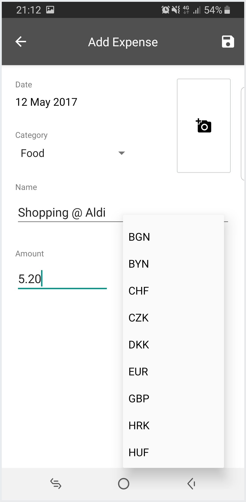
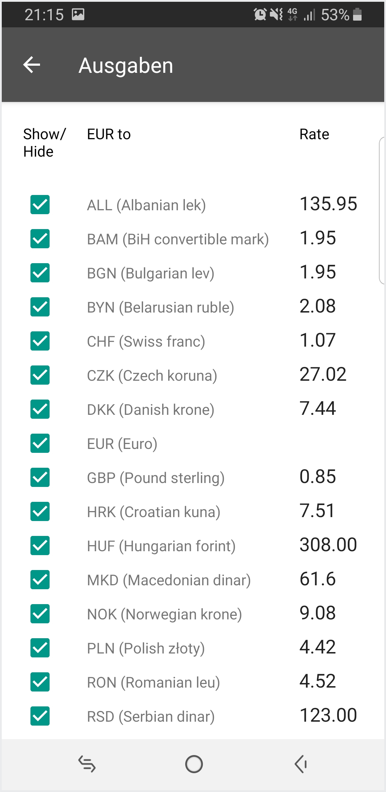
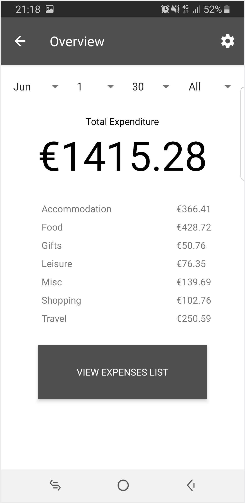
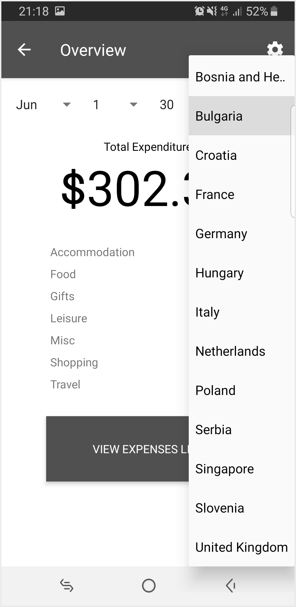
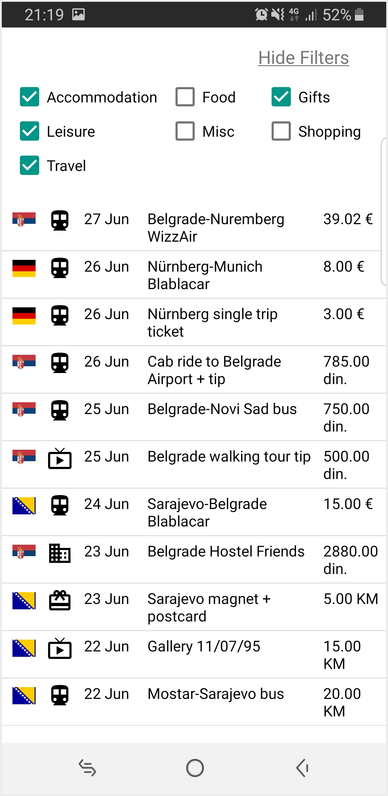
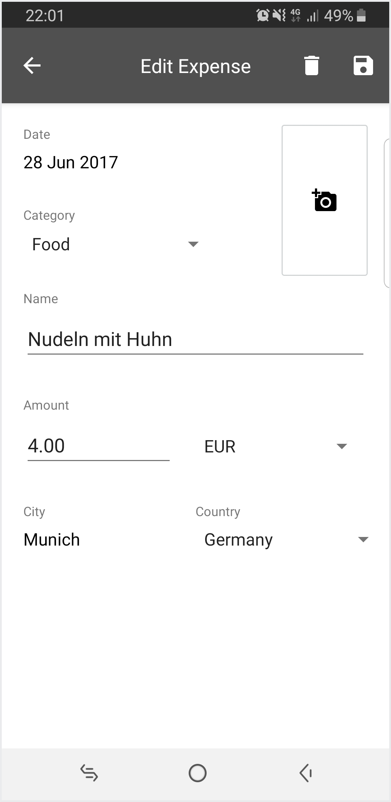

# Ausgaben

## Background

Ausgaben is an Android app that I had developed in the span of ~3 months leading up to my exchange semester in Germany in the summer semester of 2017.

I had been planning to take advantage of the chance of being in Europe to travel around to a few countries in the region. I was looking for a way to easily track my expenses in a variety of foreign currencies, given that not all European countries are in the eurozone.

I tried a few of the available expense tracker apps - e.g. Pocket Expense, Spending Tracker - but I could not find one that was suited for my use case. They were either overloaded with unnecessary features, did not allow for input in foreign currencies or had a UI/UX that was disparate from my ideal.

Thus, I decided to create my own Android app to cater to my specific intentions, it being a fantastic way for me to learn Android development as well.

It had to have these features:

- Expense input with these fields:
    - Date
    - Item Name
    - Category
        - Accommodation, Food, Gifts, Leisure, Misc, Shopping, Travel
    - Amount
    - Currency
    - Photo
    - Location
        - So that I could conveniently track the amount of money that I had spent in each country during my travels
- An overview page showing my total expenses for a given date range in both EUR and SGD
- A details page to show my past expenses in detail
- A settings page to amend the currency forex rate
    - So that the conversion back to EUR/SGD would be as accurate as possible

## Documentation

The technical documentation can be found in the [documentation Markdown file](documentation.md).

## Screenshots

### Main page

- **Overview** and **Add Expenses** buttons - self-explanatory
- Location - shows the current location based on GPS data
    - Tapping on it will refresh the location
- Currency symbol
    - Opens the [forex rates page](#amending-the-forex-rates) for amendment
- Ellipsis at the top-right
    - Allows for import/export of the expenses data from/to a CSV file

### Adding an expense

- Easy addition of an expense with the desired fields
- A photo can be attached to the expense by clicking on the camera icon at the top-right
- Location is implicitly captured based on the location data on the main page

- Tapping on the **Currency** dropdown displays a list of available currencies
- This currency list had been filtered to the currencies used by countries that I thought there was a chance to visit

### Amending the forex rates

- Allows for editing of the forex rate to EUR
- Allows unimportant currencies to be hidden so that it does not appear in the "Add Expenses" page

### Overview page

- View the total expenditure for a specified date range
- **View Expenses List** redirects to the [details page](#details-page) that lists the individual expenses in detail

- Tapping on the **Total Expenditure** value toggles the display between EUR and SGD

- Tapping the dropdown field on the top-right shows the country filter

### Details page

- Lists the details of each individual expense
- Country flag provides a visual depiction of the country that the expense had been recorded in

- List of expenses can be filtered by category when tapping on the **Show Filters** button at the top

- Tapping on a row will display the "Edit Expense" page
- **Location** field appears when editing an expense so that it can be amended in case the location had been erroneously captured (e.g. travelled from point A to B and recorded an expense at point B without the location updating to that of point B)
- Trash can icon on the navbar allows for deletion of expense
