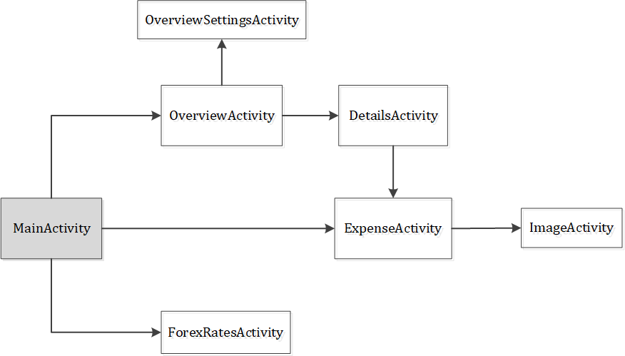

# Ausgaben Technical Documentation

## Overview

The app contains 5 activities (i.e. pages); the activity flow is represented in the following diagram.

The database used by the app is a local SQLite database. The Singleton pattern is used for database management.

## Database

### Database columns

The database columns are listed in the following table. All have property “NOT NULL” except `imagepath`.

The expense ID, which auto-increments by 1 for each expense added, is used as the unique identifier.

| Column | Type | Remarks |
| --- | --- | --- |
| `id` | INTEGER | PRIMARY KEY |
| `date` | INTEGER |  |	
| `name` | TEXT |  |
| `category` | TEXT |  |	
| `amount` | DECIMAL(10, 2) |  |	
| `currency` | TEXT |  |
| `forexrate`	| DECIMAL(5, 2) | |
| `forexrate_eurtosgd` | DECIMAL(3, 2) | |
| `city` | TEXT |  |
| `country` | TEXT |  |	
| `imagepath` | TEXT | Can be null |

### Database methods

`createExpense(long date, String name, String category, BigDecimal amount, String currency, SharedPreferences mPrefs, String city, String country, String imagePath)`

- Adds the data into a `ContentValues` object
- The expense is added to the database and the ID of the expense is returned

`editExpense(long editId, long date, String name, String category, BigDecimal amount, String currency, SharedPreferences mPrefs, String city, String country, String imagePath)`

- Retrieve the current row of expense data based on the `editId`
- Adds the new data into a `ContentValues` object
- Compare the differences between the old and new data, and store it in an `isEditsMade` array
- If the currency of the expense had been changed, then modify the forex rate as well

`deleteExpense(long deleteId)`	

- Deletes the specified expense from the database

`getExpensesList(int month, String country, int startDate, endDate)`	

- Returns an ArrayList of expenses within the specified month and dates and occurring in the specified country

`getCountriesList()`

- Returns an ArrayList of countries that are currently present in the database

`getCategoryExpenditure(String category, int month, int startDate, int endDate, String displayCurrency, String country)`

- Obtains the total expenditure for expenses of the specified category within the specified month/date range in the correct display currency and made in the correct country

`deleteAllExpenses()`

- Deletes all expenses from the database

### Helper methods

`expenseWithinMonthAndDateRange(long expenseDate, int month, int startDate, int endDate)`

- Checks if the date of the expense falls within the specified month and date range

`expenseWithinCategory(String expenseCategory, String category)`

- Checks if an expense is of a specified category

`expenseWithinCountry(String expenseCountry, String country)`

- Checks if an expense was made in a specified country

`getExpenseDetails(Cursor cursor)`

- Returns all the details of an expense in an Expense object

`getExpenditureAmount(String amt, double forexRate)`

- Returns the expenditure amount in EUR

`convertExpenditureAmountToSgd(BigDecimal amount, double forexRateEurToSgd)`

- Converts the expenditure amount from EUR to SGD

`compareDifferences(Expense expense, ContentValues values)`

- Compares the old and new values in the data fields
- Returns a boolean array indicating the edited fields

`getForexRate(SharedPreferences prefs, String currency)`

- Returns the forex rate (to EUR) for the specified currency

## Activities

A common action upon activity creation for most of the activities is the setup of the toolbar; this is hereby omitted in the write-up of the individual sections.

There are 4 common data entries stored in the `Bundle` between activities – `displayMonth`, `displayCountry`, `displayStartDate`, `displayEndDate`. This preserves the consistency in the date/country filters in `OverviewActivity` and `DetailsActivity` when toggling between `OverviewActivity`, `DetailsActivity` and `ExpenseActivity`.  

### MainActivity

`MainActivity` serves as the main landing page upon opening the app.

#### External links

- Google Location API

#### Upon activity creation

- Verification check for location permissions
- Initialise location clients (via the Google Play Services API client)
- Set location text
- Set forex rates, if it is a first-time startup. All rates are set to be displayed by default.

#### Widgets

| Widget | Action |
| --- | --- |
| "Overview" button | Starts `OverviewActivity` |
| "Add Expense" button | Starts `ExpenseActivity` |
| Forex icon | Starts `ForexRatesActivity` |
| Location icon | Updates the location from the Google API client |

#### Helper methods

`updateWithNewLocation()`

- Gets the city and country name from the Geocoder API based on the latitudinal and longitudinal coordinates
- Updates the data stored under the `location` key in `SharedPreferences`
- Calls `setLocationText()`

`setLocationText()`

- Updates the `TextView` with the city name (if applicable) and country name from `SharedPreferences`

#### CSV helper methods

Manages the import/export of CSV data from the database.		

`importDatabase()`

- Reads in a CSV file from the assets folder
- Required format of CSV file:
    - Date (YYYYMMDD)
    - Name
    - Category
    - Amount
    - Currency
    - Forex rate (input currency to SGD)
    - Forex rate (EUR to SGD)
    - City
    - Country
    - Image path, if applicable
- Reads each entry and parses it into a `SQL INSERT` query to add the entry to the database

`exportDatabase()`

- Verification check for storage permissions
- Initialises a `BufferedWriter` to the output file
- Reads each entry in the database and writes each column data to the `BufferedWriter`

#### Remarks

- Forex rates are stored in `SharedPreferences` under key `forexRates`
- Current location is stored in `SharedPreferences` under key `location`

### ExpenseActivity

`ExpenseActivity` serves 2 purposes:

1. Add an expense to the database
2. Edit an existing expense in the database (`isEditExpense` will be set to true)

An `isEditsMade` array keeps track of the items that have been edited (`isDateEdited`, `isNameEdited`, `isCategoryEdited`, `isAmountEdited`, `isCurrencyEdited`, `isCountryEdited`, `isImagePathEdited`).

#### Upon activity creation

- Opens the database
- Sets the relevant displays for the activity elements
- Populates the input fields with data from the Bundle, if editing an existing expense
- Sets the visibility of the input currencies, based on the toggle settings in `ForexRatesActivity`

#### Bundle data (when editing an expense)

| Key | Content |
| --- | --- |
| `id` | ID of expense being edited |
| `date` | Date of expense |
| `name` | Name of expense |
| `category` | Category of expense |
| `amount` | Amount of expense |
| `currency` | Input currency of expense |
| `country` | Country at the time the expense was entered into the database |
| `imagepath` | Attached image of expense, if applicable |
| `scrollIndex` | Saved scroll position from `DetailsActivity` |
| `scrollOffset` | Saved scroll position from `DetailsActivity` |

#### Widgets

##### Back/Cancel button

- If `isEditExpense` is false, starts `MainActivity`
- If `isEditExpense` is true, starts `DetailsActivity`
    - The 4 common data, along with `scrollIndex` and `scrollOffset`, are added to the `Intent` object
    - The filter settings in the `Intent` object from `DetailsActivity` are also added to the `Intent` object

##### Date
    
- Opens the date picker dialog

##### Camera icon

- Opens the camera

##### Existing photo

- Opens an alert dialog with the following options:
    - View photo – starts `ImageActivity`, with the image path included in the `Intent` object
    - Take new photo – opens the camera
    - Remove photo – removes the photo from the display

##### "Save" button
    
- Input data (date, name, category, amount, currency) is extracted into a `Quintuple` object
- If adding a new expense:
    - The input data, along with the forex rates, city name, country name and image path are passed as parameters into the `createExpense()` method in `DatabaseExpenses`. Starts `DetailsActivity`
- If editing an expense:
    - If the attached image had been removed, remove it from internal storage as well
    - If the attached image had been updated, update the image path (old image is not deleted in this case)
    - The same group of data, along with the `editExpenseId`, are passed as parameters into the `editExpense()` method in `DatabaseExpenses`
    - The previous filter settings for `DetailsActivity` and the `isEditsMade` array are added to the `Intent` object
    - Starts `DetailsActivity`

##### "Delete" button (only present if editing expense)

- Opens a delete confirmation dialog
- If confirmed:
    - `deleteExpense()` method in `DatabaseExpenses` is called
    - Deletes the image from internal storage, if applicable
    - Starts `DetailsActivity`

#### Camera methods

`openCamera()`

- Opens the `Intent` object for image capture

`createImageFile()`

- Creates an image file with the name format `JPEG_<yyyyMMdd_HHmmss>_`
- Saves the image file in the Pictures directory
- Updates the `currentPhotoPath` variable to the generated image filepath

`onActivityResult()` (superclass method to obtain data from camera)

- Obtains the file linked from the `currentPhotoPath` as a bitmap image
- Displays the bitmap image

`getBitmap(File)`

- Returns a `Bitmap` object from the `File` object

`setImageRotation(Bitmap)`

- No idea what the hell this method is doing, but the end result is that the image will be displayed correctly in portrait/landscape 

#### Helper methods

`updateDateDisplay()`

- Updates the `TextView` with the desired date

`extractInputData()`

- Gets the input data (date, name, category, amount, currency) and returns it as a `Quintuple` object

`extractInputCountry()`

- 	Gets the input country
- Only used when editing an existing expense

`filterHiddenCurrencies()`

- Filters the list of currencies to be displayed in the Currency spinner, based on the toggle values in the `SharedPreferences`

`setDisplayMonth()`

- Sets the month to that of the expense being added/edited
- This is used for the filter settings in `DetailsActivity`

`setCategorySpinner(Spinner, category)`

- Sets the `Category` spinner to the category of the expense being edited

`setCurrencySpinner(Spinner, currency)`

- Sets the `Currency` spinner to the currency of the expense being edited

`setCountrySpinner(Spinner, country)`

- Sets the `Country` spinner to the country of the expense being edited

#### Storage methods

`saveImageToInternalStorage(Bitmap)`

- Saves the `Bitmap` file to internal storage at 100% quality

`deleteImageFromInternalStorage()`

- Deletes the attached image file

`loadImageFromStorage(ImageView)`

- Sets the `ImageView` to the `Bitmap` file obtained from the attached image

### OverviewActivity

`OverviewActivity` provides an overview of expenses made within a specified time range, and/or in a specific country.

#### Upon activity creation

- Opens the database
- Initialise click listeners for the widgets
- Populates the Country spinner with a list of existing countries in the database
- Sets the correct display parameters for the month, start date, end date, currency
    - These information are stored in the `Intent` object, if applicable
    - Month is set to current month by default
    - Date range is set to the entire month by default
    - Country is set to "All" by default

#### Widgets

Any modification of the month, start/end dates and country will update the displayed expense value accordingly.

| Widget | Action |
| --- | --- |
| Back button | Starts `MainActivity` |
| Set Defaults toolbar icon	| Starts `OverviewSettingsActivity` |
| Month spinner | Opens the Spinner to select a display month. If "All Months" are selected, the start/end date spinners are set to invisible. |
| Start Date spinner | Self-explanatory |
| End Date spinner | Self-explanatory |
| Country spinner | Self-explanatory |
| "Total Expenditure" amount | Toggles the displayed expenditure amount between SGD and EUR |
| "View Expenses List" button | Starts `DetailsActivity` with the relevant search parameters |

#### Helper methods

`setDateRange(int month)`

- Sets the range of dates in the date spinners based on the display month
- The specified date range will set based on the data in the `Intent` object, if applicable

`updateExpenseValuesDisplayed()`

- Updates all expense values (including the values in the individual categories) displayed on the screen based on the date and country filter parameters

`getCountrySpinnerIndex(String country)`

- Returns the Spinner index at which the specified country is stored

### DetailsActivity

`DetailsActivity` displays the expenses within the specified search parameters in a list format. Clicking on an expense will allow the user to edit the particular expense.

#### Upon activity creation

- Opens the database
- Set display parameters (month, country, start date, end date)
- Initialises the `ListView` and sets it to the previously saved scroll position, if applicable

The following actions are only applicable when returning from `ExpenseActivity`:

- Sets the saved scroll position of the `ListView`
- Sets the category filter settings
- Gets the details of which piece of information has been edited, to allow for the highlighting of any modifications

#### Widgets

##### Back button

- Starts `OverviewActivity` or `ExpenseActivity`, depending on which had been the previous screen

##### List entry

- Clicking on an entry (i.e. expense) in the list will start `ExpenseActivity`, with the details of the expense inserted into the `Bundle` object
- The current scroll position of the list, display parameters and filter settings are also added to the `Bundle` object

##### Show/Hide Filters toggle line

- Toggles the display of the category filters

##### Individual category checkboxes

- Toggles the checkbox and updates the expense list displayed accordingly

#### Helper methods

`updateListView()`

-	Updates the displayed list based on the category filters
-	Calls `setListAdapter()` in `DetailsAdapter`

`displayData(boolean[] filters)`

-	Obtains an `ArrayList` of expenses to be displayed based on the category filters

`sortMostRecentFirst(ArrayList<Expense> list)`

-	Sorts the list in descending order of date
-	If 2 entries are of the same date, the entry that was entered later is placed above

`filterList(ArrayList<Expense> list, String category)`

-	Iterates through the entire `ArrayList` and removes the entries where the category corresponds to the specified category

`areDatesSimilar(Date date1, Date date2)`

-	Secondary helper method to check if 2 dates are similar
-	Used by `sortMostRecentFirst()` method

### ImageActivity

`ImageActivity` simply displays an image in the screen.

The image path is extracted from the `Intent` object and the image that it points to is converted to a `Bitmap` object, which is set in the `ImageView`.

### ForexRatesActivity

#### Upon activity creation

- Initialises the `SharedPreferences` API (keys `toggleRates` and `forexRates`), and the `Checkbox` and `TextView` widgets
- Loads the toggle settings from the `SharedPreferences` and sets the checkboxes accordingly
- Loads the saved forex rates from the `SharedPreferences` and sets the `TextView`s accordingly 

#### Widgets

| Widget | Action |
| --- | --- |
| Back button | Updates the toggle settings and forex rates, and returns to `MainActivity`. If any changes had been made, display a "Changes saved" Toast message. |

#### Helper methods

`updateToggleSettings()`

Saves the updated toggle settings of the currencies.

`updateForexRates()`

Saves the updated forex rates.

`checkForChangesMade()`

Check if there had been any modifications made (either the toggle settings or any forex rate).
